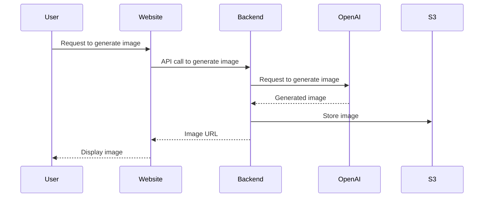

# Helios-Imagery

## Description
To build an epic website to generate images and display Helios themed images created by OpenAI. 

## Flow Diagram



## Setting Up the DevContainer

To get started with the DevContainer for this repository, follow these steps:

1. **Clone the Repository**:
    ```sh
    git clone <repository-url>
    cd <repository-directory>
    ```

2. **Copy the Sample Environment File**:
    ```sh
    cp .devcontainer/.env.sample .devcontainer/.env
    ```

3. **Fill in the Environment Variables**:
    Open the `.devcontainer/.env` file and fill in the required environment variables. For example:
    ```env
    MONGO_INITDB_ROOT_PASSWORD=yourRootPassword
    MONGO_PASSWORD=yourMongoPassword
    MINIO_ROOT_USER=yourMinioUser
    MINIO_ROOT_PASSWORD=yourMinioPassword
    ```

4. **Open the Repository in Visual Studio Code**:
    ```sh
    code .
    ```

5. **Reopen in Container**:
    - Press `F1` to open the command palette.
    - Type and select `Remote-Containers: Reopen in Container`.

6. **Wait for the Container to Build**:
    The first time you build the container, it may take a few minutes as it sets up the environment.

7. **Log into Minio**:
    - Open your web browser and navigate to `http://localhost:9000`.
    - Log in using the `MINIO_ROOT_USER` and `MINIO_ROOT_PASSWORD` you specified in the `.env` file.

8. **Create S3 Access Key / Secret**:
    - Once logged in, click on your username in the top right corner and select `Access Keys`.
    - Click on `Create Access Key`.
    - Note down the `Access Key` and `Secret Key` generated. These will be used as `S3_ACCESS_KEY_ID` and `S3_SECRET_ACCESS_KEY` in your `.env` file.

9. **Verify the Setup**:
    - Ensure that the MongoDB and Minio services are running correctly.
    - You can check the logs in the Docker extension in VS Code or use the terminal to verify the services.

10. **Start Developing**:
    Once the container is up and running, you can start developing within the DevContainer environment.

11. **Happy Coding**

For more details on DevContainers, refer to the [Visual Studio Code documentation](https://code.visualstudio.com/docs/remote/containers).