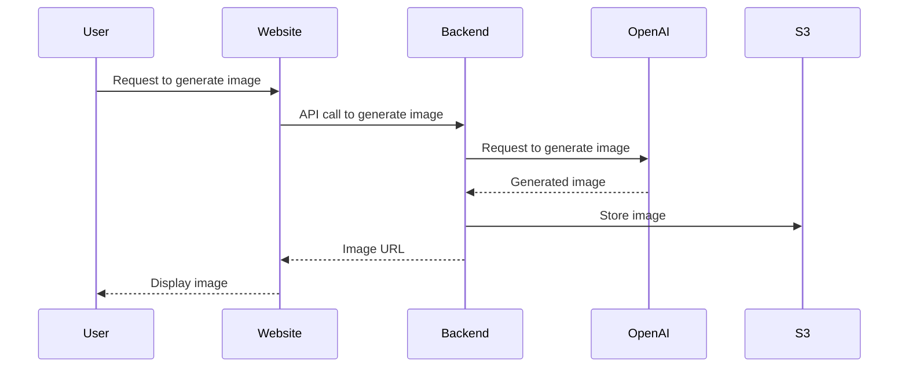

# Helios-Imagery

## Description
Welcome to **Helios-Imagery**! This project aims to build an epic website to generate and display Helios-themed images created by OpenAI.

## Flow Diagram



## Setting Up the DevContainer

To get started with the DevContainer for this repository, follow these steps:

1. **Clone the Repository**:
    ```sh
    git clone <repository-url>
    cd <repository-directory>
    ```

2. **Copy the Sample Environment File**:
    ```sh
    cp .devcontainer/.env.sample .devcontainer/.env
    ```

3. **Fill in the Environment Variables**:
    Open the `.devcontainer/.env` file and fill in the required environment variables. For example:
    ```env
    MONGO_INITDB_ROOT_PASSWORD=yourRootPassword
    MONGO_PASSWORD=yourMongoPassword
    MINIO_ROOT_USER=yourMinioUser
    MINIO_ROOT_PASSWORD=yourMinioPassword
    ```

4. **Open the Repository in Visual Studio Code**:
    ```sh
    code .
    ```

5. **Reopen in Container**:
    - Press `F1` to open the command palette.
    - Type and select `Remote-Containers: Reopen in Container`.

6. **Wait for the Container to Build**:
    The first time you build the container, it may take a few minutes as it sets up the environment.

7. **Log into Minio**:
    - Open your web browser and navigate to `http://localhost:9000`.
    - Log in using the `MINIO_ROOT_USER` and `MINIO_ROOT_PASSWORD` you specified in the `.env` file.

## Running the Next.js App

To run the Next.js app, follow these steps:

1. **Install Dependencies**:
    Navigate to the `app` directory and install the required dependencies:
    ```sh
    cd app
    npm install
    ```

2. **Run the Development Server**:
    Start the Next.js development server:
    ```sh
    npm run dev
    ```

3. **Open the App in Your Browser**:
    Open your web browser and navigate to `http://localhost:3000` to see the app in action.

4. **Build the App for Production**:
    To build the app for production, run:
    ```sh
    npm run build
    ```

5. **Start the Production Server**:
    After building the app, you can start the production server with:
    ```sh
    npm start
    ```

Enjoy building and exploring Helios-Imagery!