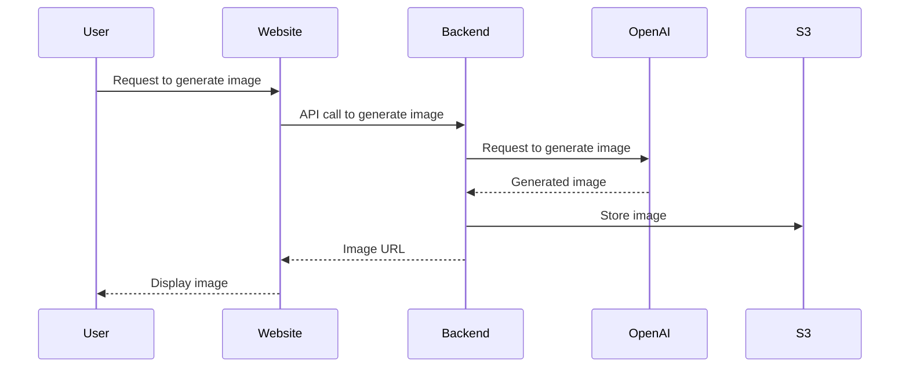

# Helios-Imagery

## Description
Welcome to **Helios-Imagery**! This project aims to build an epic website to generate and display Helios-themed images created by OpenAI.

## Flow Diagram



## Setting Up the DevContainer

To get started with the DevContainer for this repository, follow these steps:

1. **Clone the Repository**:
    ```sh
    git clone <repository-url>
    cd <repository-directory>
    ```

2. **Copy the Sample Environment File**:
    ```sh
    cp .devcontainer/.env.sample .devcontainer/.env
    ```

3. **Fill in the Environment Variables**:
    Open the `.devcontainer/.env` file and fill in the required environment variables. For example:
    ```env
    MONGO_INITDB_ROOT_PASSWORD=yourRootPassword
    MONGO_PASSWORD=yourMongoPassword
    MINIO_ROOT_USER=yourMinioUser
    MINIO_ROOT_PASSWORD=yourMinioPassword
    ```

4. **Open the Repository in Visual Studio Code**:
    ```sh
    code .
    ```

5. **Reopen in Container**:
    - Press `F1` to open the command palette.
    - Type and select `Remote-Containers: Reopen in Container`.

6. **Wait for the Container to Build**:
    The first time you build the container, it may take a few minutes as it sets up the environment.

7. **Log into Minio**:
    - Open your web browser and navigate to `http://localhost:9000`.
    - Log in using the `MINIO_ROOT_USER` and `MINIO_ROOT_PASSWORD` you specified in the `.env` file.

## Running the Next.js App

To run the Next.js app, follow these steps:

1. **Install Dependencies**:
    Navigate to the `app` directory and install the required dependencies:
    ```sh
    cd app
    npm install
    ```

2. **Run the Development Server**:
    Start the Next.js development server:
    ```sh
    npm run dev
    ```

3. **Open the App in Your Browser**:
    Open your web browser and navigate to `http://localhost:3000` to see the app in action.

4. **Build the App for Production**:
    To build the app for production, run:
    ```sh
    npm run build
    ```

5. **Start the Production Server**:
    After building the app, you can start the production server with:
    ```sh
    npm start
    ```

Enjoy building and exploring Helios-Imagery!


# Helios Gallery Project - Technology Overview

The **Helios Gallery Project** is a web-based, AI-driven platform that enables users to create, view, and engage with custom-generated images. This document provides an overview of the core technologies and tools that made the project possible, along with useful reference links for further exploration.

---

## 1. Project Architecture and Key Technologies

### Frontend
- **Framework**: **Next.js** (React + TypeScript) for creating a dynamic, SEO-friendly web application.
- **Styling**: **Bootstrap** and **TailwindCSS** for responsive design and flexible theming.
- **Key Features**:
  - **Madlib-Style Image Generation**: Customizable form-based UI for generating images.
  - **Game Mode**: A Rock-Paper-Scissors game, enhanced with AI-driven taunts.
  - **Gallery and Profile**: Interfaces for viewing, voting, and ranking images, plus a profile page with user history.

### Backend For Frontend (BFF)
- **Purpose**: Acts as an intermediary between the frontend and backend services to streamline API interactions.
- **Technologies**:
  - **MongoDB**: Stores user data, image metadata, and vote counts.
  - **BullMQ** (with Redis): Manages task queues for image generation and email notifications.
  - **SendGrid**: Sends email notifications with generated image links to users.
  - **Fetch API**: Facilitates API communication between the BFF and backend workflows.

### Automation Workflows
- **Platform**: **n8n**
  - Used to build and automate workflows, handling tasks such as image generation, email notifications, error logging, and gallery management.
  - **Workflow Examples**:
    - **Image Generation**: Processes user inputs, communicates with AI models, and stores generated images.
    - **Rock-Paper-Scissors Game Logic**: Manages game responses based on AI-powered taunts.
    - **Error Handling and Logging**: Notifies team members of errors via Discord, ensuring quick troubleshooting.

### AI and External Integrations
- **ChatGPT 4**: Used for coding support, user interaction (taunts), and image prompt generation.
- **Midjourney**: Generates high-quality, custom images based on user inputs.
- **OpenAI APIs**: Integrated within n8n workflows to validate prompts and generate custom responses.
- **JokeAPI**: Provides humor elements during loading screens to enhance user experience.
- **Grafana Faro**: Monitors application performance for insights and debugging.

---

## 2. Environment and Data Management

- **Environment Configuration**: 
  - `.env` files manage sensitive information such as API keys, database credentials, and service URLs.
  - Support for different environments (development and production).
- **Data Storage**:
  - **MongoDB**: Stores all persistent user-related data.
  - **MinIO** (S3-compatible storage): Hosts generated images, with a CDN ensuring quick, reliable access.

---

## 3. Unique Aspects and User Experience Enhancements

- **Light/Dark Modes**: Switches between a professional light mode (HELIOS) and a whimsical dark mode (DEP).
- **Error Handling**: Automated notifications via Discord alert team members of any issues in real-time.
- **Automated AI Interactions**: Dynamic game interactions and customized titles generated by AI enhance the user experience.
- **Scalable Architecture**: Task queues (BullMQ with Redis) and workflow automation (n8n) ensure that the project scales smoothly with increasing user demand.

---

## 4. Key Links and References

- **Project GitHub Repository**: [Helios Gallery Project on GitHub](https://github.com/GMIC-Helios-Team/HeliosGallery)
- **n8n Documentation**: [n8n Docs](https://docs.n8n.io/)
- **MongoDB Documentation**: [MongoDB Docs](https://docs.mongodb.com/)
- **BullMQ Documentation**: [BullMQ Docs](https://docs.bullmq.io/)
- **Next.js Documentation**: [Next.js Docs](https://nextjs.org/docs)
- **SendGrid Documentation**: [SendGrid Docs](https://docs.sendgrid.com/)
- **TailwindCSS Documentation**: [TailwindCSS Docs](https://tailwindcss.com/docs)
- **OpenAI API Documentation**: [OpenAI API Docs](https://beta.openai.com/docs/)
- **Midjourney Information**: [Midjourney](https://www.midjourney.com/)

---

## 5. Summary of Technical Advantages

- **User-Friendly Interface**: Powered by Next.js, Bootstrap, and TailwindCSS.
- **Rich Automation**: n8n workflows for backend automation, reducing manual intervention.
- **Robust Data Storage**: MongoDB and MinIO for secure and reliable data management.
- **Advanced AI Integration**: ChatGPT and Midjourney for a personalized, dynamic user experience.
- **Automated Monitoring and Logging**: Real-time error logging and performance monitoring through Discord and Grafana Faro.

---

This document provides a broad view of the tech that drove the Helios Gallery Project and highlights its unique blend of AI, automation, and scalable architecture. For further questions or a more detailed technical breakdown, please refer to the linked resources or reach out to the project team.

--- 
